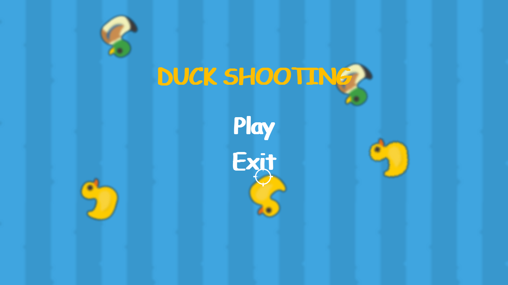
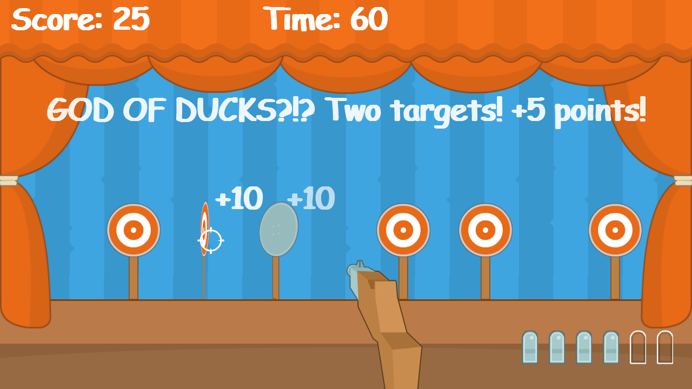

# Duck Shooting

***Duck Shooting*** is my first game written in Python using pygame (originally, but I switched to pygame-ce later). **It is just meant to be**, I am having so much fun developing something, so here we are! There will be **ducks, crabs, stick targets, juicy seascapes & sand, ranchos, grassland steppes...** But most of this is still in development, so if there's an artist out there who would like to contribute some ideas or implementations for images, sprites & backgrounds - ***I'd love to work with you!***

## **Screenshots**

## **Dependencies**
1. [**pygame-ce**](https://github.com/pygame-community/pygame-ce)

## **LICENSE**
The game is licensed under the **Creative Commons Zero v1.0 Universal License**. For more details, view the [LICENSE](./LICENSE)
